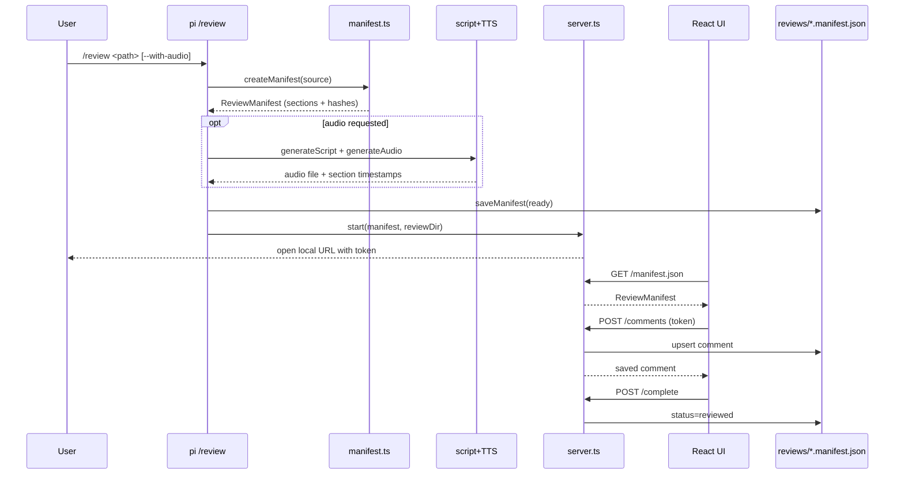
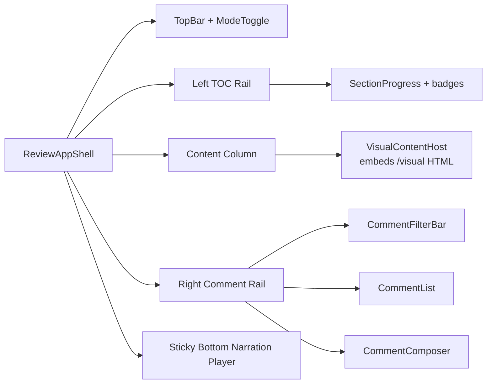

# Technical Design: Review Hub UI Refresh (React + shadcn + Motion)

## 1. Overview

We will migrate Review Hub’s web client from vanilla HTML/CSS/JS to a built React app using Vite, Tailwind v4, shadcn/ui, Lucide icons, and Framer Motion, while preserving the existing `/review` generation pipeline and local server security model. The backend remains extension-first (`index.ts`, `lib/manifest.ts`, TTS modules), and `lib/server.ts` is extended to safely serve built frontend assets plus unchanged review APIs. Data contract compatibility is maintained via additive schema evolution (not breaking existing manifests).

---

## 2. High-Level Architecture

### 2.1 System Architecture

```mermaid
graph TD
  A[pi command/tool layer\nindex.ts] --> B[Review generation pipeline\nmanifest/script/TTS]
  B --> C[Review artifacts\n.features/<feature>/reviews/*]
  B --> D[Local Review Server\nlib/server.ts]

  D --> E[Built React App\nweb-app/dist]
  D --> F[/manifest.json]
  D --> G[/comments + /complete]
  D --> H[/audio]
  D --> I[/visual + /visual-styles]

  E --> F
  E --> G
  E --> H
  E --> I

  J[Source markdown] --> B
  G --> C
```

### 2.2 Core Review Data Flow



### 2.3 UI Layout Architecture



---

## 3. Codebase Analysis (What Already Exists)

### 3.1 Reusable Backend/Core Modules

| Module | Path | Reuse in this feature |
|---|---|---|
| Extension orchestration | `extensions/review-hub/index.ts` | Reuse generation/apply/list command flow; no architecture rewrite |
| Manifest model + parser | `extensions/review-hub/lib/manifest.ts` | Reuse as source of truth; add additive fields only |
| Local review HTTP server | `extensions/review-hub/lib/server.ts` | Reuse auth + API endpoints; extend static build serving |
| Visual markdown renderer | `extensions/review-hub/lib/visual-generator.ts` | Reuse server-side visual generation and style endpoint |
| Apply pipeline | `extensions/review-hub/lib/applicator.ts` | Reuse unchanged |
| Script generation | `extensions/review-hub/lib/script-generator.ts` | Reuse unchanged |
| TTS provider interface + providers | `extensions/review-hub/lib/tts/*` | Reuse unchanged; UI consumes audio state |

### 3.2 Existing Frontend to Replace

| Current file | Path | Migration action |
|---|---|---|
| Static shell | `extensions/review-hub/web/index.html` | Replace with React app entry output |
| Vanilla app state/UI | `extensions/review-hub/web/app.js` | Replace with typed React components/hooks |
| Global CSS theme | `extensions/review-hub/web/styles.css` | Replace with Tailwind + shadcn tokens + local overrides |

### 3.3 Existing Patterns to Follow

- Session token auth for mutations (`X-Session-Token`) must remain intact.
- Manifest file is persisted atomically and is authoritative for comment state.
- Audio sync uses section timestamps merged into `manifest.sections`.
- Localhost-only serving and strict path protection are non-negotiable.

---

## 4. Data Model

## 4.1 Modified Entities (Additive, Backward Compatible)

### `ReviewComment` additions

Current comments do not persist resolution state. To support unresolved navigation and review workflow:

```ts
interface ReviewComment {
  // existing fields...
  status?: "open" | "resolved"; // default "open" if omitted
  updatedAt?: string;             // ISO timestamp for edit/resolve changes
}
```

Compatibility rule:
- If `status` is missing (older manifests), treat as `open`.
- Existing manifests remain valid.

### `ReviewManifest` additions (optional UI metadata)

```ts
interface ReviewManifest {
  // existing fields...
  ui?: {
    mode?: "read" | "review"; // optional persisted preference (safe additive)
  }
}
```

This field is optional; frontend can keep it local if we avoid persistence in v1.

### 4.2 Relationships

- `ReviewComment.sectionId` continues to map to `ReviewSection.id`.
- Unresolved queue derives from comments where `status !== "resolved"`.

---

## 5. API Design

## 5.1 Existing Endpoints Reused

| Method | Path | Purpose |
|---|---|---|
| GET | `/manifest.json` | Load review manifest + comments |
| POST | `/comments` | Create/update comment |
| DELETE | `/comments/:id` | Delete comment |
| POST | `/complete` | Mark review done |
| GET | `/audio` | Stream audio artifact |
| GET | `/visual` | Server-generated visual HTML |
| GET | `/visual-styles` | Visual CSS |

## 5.2 Contract Extension

`POST /comments` request body may include additive fields:
- `status?: "open" | "resolved"`
- `updatedAt?: string`

Server validation changes:
- Accept status if present.
- Normalize missing status to `open` at write time for newly created comments.
- For updates, set `updatedAt = now` server-side.

## 5.3 Static Assets Serving

`lib/server.ts` static handling changes:
- Serve built frontend files from `web-app/dist` (or configured dist dir).
- Allow `/assets/*` hashed files with strict directory containment checks.
- Keep existing security guarantees (no arbitrary fs access).
- SPA fallback to `index.html` for non-API, non-asset paths.

---

## 6. Component Architecture (Frontend)

Frontend source location:
- `extensions/review-hub/web-app/` (new)

### 6.1 Top-Level Structure

| Component | Responsibility | Reuses |
|---|---|---|
| `ReviewAppShell` | Global layout + data bootstrapping | Existing API contracts |
| `TopBar` | Title, doc metadata, mode toggle, done action | shadcn Button/Badge/Tooltip |
| `TocRail` | Section nav + active state + unresolved counts | Manifest section map |
| `VisualContentHost` | Render `/visual` HTML, sync section visibility | Existing visual output |
| `CommentRail` | Filtering + unresolved navigation + list | Existing comments schema (+status) |
| `CommentComposer` | Create/edit comment UI | Existing comment types/priorities |
| `NarrationPlayerBar` | Sticky bottom audio controls + sync toggle | Existing `/audio` + timestamps |
| `AudioStateBanner` | generating/ready/failed/not-requested state UI | `manifest.audioState` |

### 6.2 State Management

- React Query is optional; base design uses lightweight local state + API service hooks.
- Core local state:
  - `manifest`
  - `comments`
  - `activeSectionId`
  - `mode` (`read` | `review`)
  - `filters`
  - `syncEnabled`
- Derived state:
  - unresolved comments list
  - TOC section badges

### 6.3 Data Fetching

- `useReviewApi(token)` hook wraps existing endpoints.
- Initial boot:
  1. parse token from URL
  2. fetch manifest
  3. hydrate comments and section metadata

### 6.4 Motion System

- Use Framer Motion for:
  - mode transitions,
  - rail entry/exit,
  - section highlight transitions,
  - comment card insert/remove transitions.
- Enforce reduced motion via `useReducedMotion()` and conditional transitions.

### 6.5 Icon System

- Use `lucide-react` only.
- Replace all functional emoji controls.
- Icon-only controls must have `aria-label`.

---

## 7. Backend Architecture

## 7.1 Handler → persistence flow remains

- `POST /comments` and `DELETE /comments/:id` continue to mutate `state.manifest.comments` and persist via `saveManifest`.
- Extend validation to support `status` additive field.
- Keep token validation logic unchanged.

## 7.2 Static serving modernization

`lib/server.ts` update:
- Introduce dist directory resolver:
  - prefer built React dist if present,
  - optional fallback to legacy `web/` during migration window.
- Replace strict old allowlist (`/app.js`, `/styles.css`) with safe static file resolver limited to dist root and known extensions.

## 7.3 Visual endpoint strategy

- Keep `/visual` and `/visual-styles` server-generated.
- React host embeds this HTML in center column.
- Remove/replace any emoji control emitted by visual generator (section comment button content should be icon-ready hook target).

---

## 8. Integration Points

- `index.ts` uses unchanged review generation pipeline and opens same server URL.
- `lib/manifest.ts` remains canonical schema; additive fields only.
- `lib/server.ts` bridges React app to existing API/auth and artifact files.
- `web-app` build process must be integrated into extension workflow and README.
- Existing log files and review artifact paths stay unchanged.

---

## 9. Implementation Plan per User Story

### US-001: React + Vite + Tailwind + shadcn foundation

**What changes:**
- `extensions/review-hub/web-app/package.json` (new)
- `extensions/review-hub/web-app/vite.config.ts` (new)
- `extensions/review-hub/web-app/components.json` (new)
- `extensions/review-hub/web-app/src/*` (new app shell)
- `extensions/review-hub/package.json` (scripts for web build)

**How it works:**
- Introduce isolated frontend workspace that builds static assets.
- shadcn/ui components generated into `web-app/src/components/ui`.

### US-002: Server delivery for built UI assets

**What changes:**
- `extensions/review-hub/lib/server.ts`

**How it works:**
- Serve dist assets safely (`/assets/*`), preserve API routes, and maintain token auth logic.
- Add fallback behavior if build artifacts missing (clear message and/or legacy fallback).

### US-003: 3-column IA + mode toggle

**What changes:**
- `web-app/src/components/layout/ReviewAppShell.tsx`
- `web-app/src/components/layout/TocRail.tsx`
- `web-app/src/components/layout/CommentRail.tsx`
- `web-app/src/components/layout/TopBar.tsx`

**How it works:**
- Desktop-first 3-column layout with collapsible rails on smaller viewports.
- Read/review mode toggles visibility density and panel behavior.

### US-004: Icon system migration

**What changes:**
- `web-app/src/components/**/*` (all controls)
- `extensions/review-hub/lib/visual-generator.ts` (remove emoji output for section action affordance)

**How it works:**
- Replace emoji controls with Lucide icons + labeled controls.

### US-005: Comment rail UX + unresolved flow

**What changes:**
- `web-app/src/components/comments/*`
- `extensions/review-hub/lib/manifest.ts` (add status field)
- `extensions/review-hub/lib/server.ts` (status validation/persistence)

**How it works:**
- Persist `status` per comment; compute unresolved queue; add next-unresolved nav.

### US-006: Sticky bottom narration player

**What changes:**
- `web-app/src/components/audio/NarrationPlayerBar.tsx`
- `web-app/src/hooks/useAudioSync.ts`

**How it works:**
- Use existing `/audio` and section timestamps to maintain compact persistent player at page bottom.

### US-007: Framer Motion system

**What changes:**
- `web-app/src/lib/motion.ts` (tokens)
- component-level motion wrappers

**How it works:**
- Standardized transitions and reduced-motion fallback applied consistently.

### US-008: Accessibility and keyboard-first flow

**What changes:**
- `web-app/src/components/**/*`
- `web-app/src/hooks/useKeyboardNavigation.ts`

**How it works:**
- Keyboard navigation for comment traversal, focus management, ARIA labeling, visible focus rings.

### US-009: Migration parity + rollout safety

**What changes:**
- `extensions/review-hub/README.md`
- optional `extensions/review-hub/lib/server.ts` fallback switch
- smoke test docs/scripts

**How it works:**
- Documented build and runtime checks, parity checklist, and safe fallback path.

---

## 10. Suggested Improvements

| Area | Current State | Suggested Improvement | Impact | Priority |
|---|---|---|---|---|
| Comment lifecycle | No persisted resolution state | Add additive `status` field | Enables true unresolved workflow | High |
| Server static routing | Hardcoded legacy routes | Dist-aware secure static resolver | Enables modern frontend stack | High |
| Visual affordance | Emoji in generated section action | Non-emoji icon hook target | Consistent UI language | Medium |
| Frontend testability | Vanilla monolith JS file | Componentized typed React structure | Better maintainability | High |
| Accessibility | Partial/manual | Explicit a11y checklist + keyboard hooks | Better usability/compliance | High |

---

## 11. Trade-offs & Alternatives

### Decision: Full React + shadcn migration
- **Chosen approach:** New React frontend with shadcn/ui and Framer Motion.
- **Alternative considered:** Keep vanilla and apply shadcn-inspired CSS only.
- **Why:** Real shadcn component ergonomics and accessibility primitives require React; long-term maintainability is better.

### Decision: Additive backend changes for comment status
- **Chosen approach:** Extend `ReviewComment` with optional `status` and `updatedAt`.
- **Alternative considered:** Derive unresolved from comment type only.
- **Why:** Derived-only approach is brittle and does not model reviewer intent.

### Decision: Keep server-side visual generation
- **Chosen approach:** Continue using `/visual` HTML output and embed in React.
- **Alternative considered:** Rebuild markdown renderer as React components.
- **Why:** Avoids high rewrite risk; keeps deterministic existing behavior.

### Decision: Dist serving with optional legacy fallback
- **Chosen approach:** Serve built dist, fallback to legacy web app if configured.
- **Alternative considered:** hard cut-over without fallback.
- **Why:** Safer rollout and easier recovery in developer environments.

---

## 12. Open Questions

- [ ] Should comment status be persisted immediately in this migration or phased (UI-only first)?
- [ ] Do we keep legacy `web/` fallback enabled by default during first release?
- [ ] Should frontend build be automatic on extension install/start, or manual documented step?
- [ ] Do we add virtualization for very large comment lists in v1 or defer?
