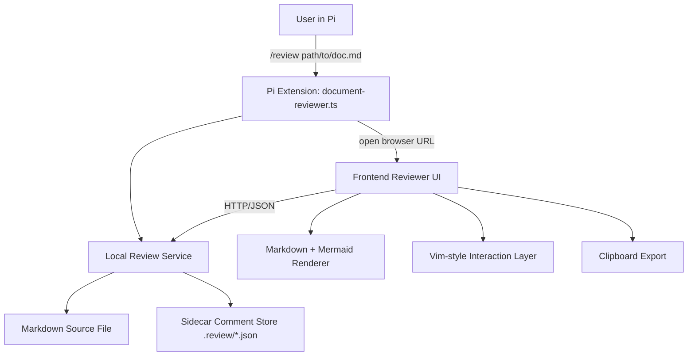
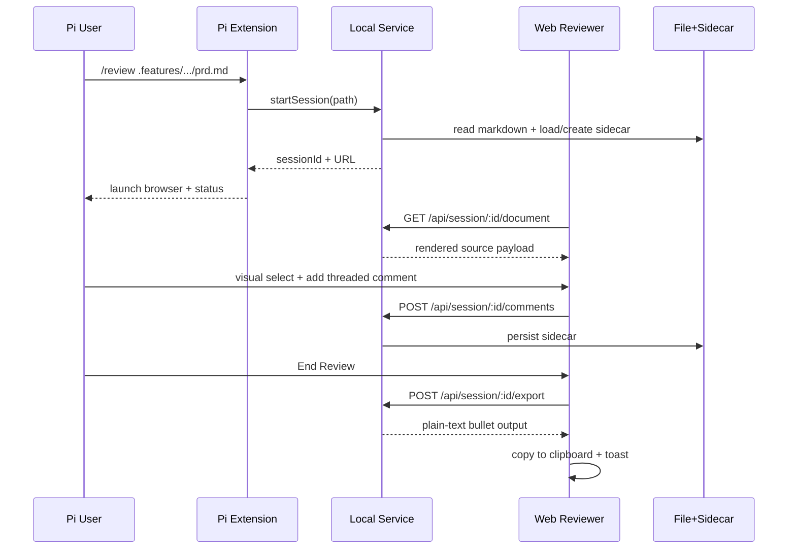
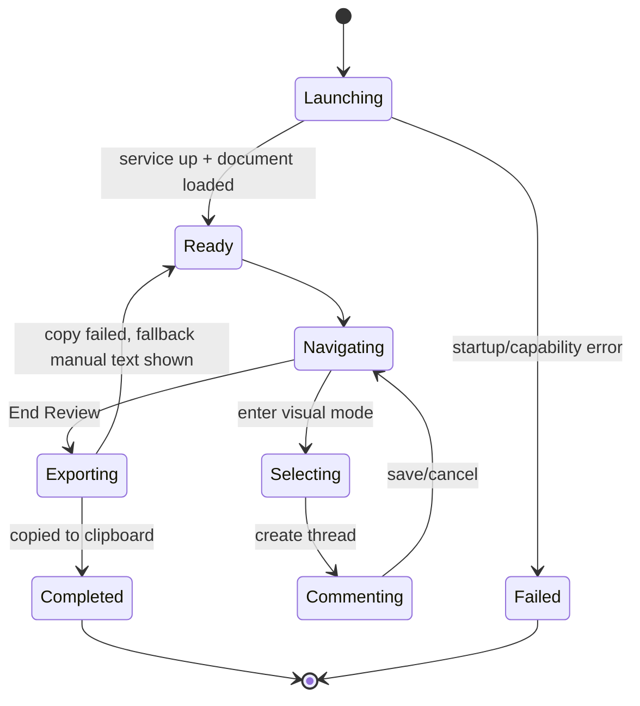

# Technical Design: document-reviewer-extension

## 1) Overview

Following your approval + latest direction (**use frontend design skill / build a UI**), this design implements a **hybrid architecture**:

- **Pi extension as control plane** (`/review` command, lifecycle, local service)
- **Frontend web reviewer UI as primary review surface** (beautiful markdown + mermaid + threaded comments + selection UX)

This keeps Pi-native workflow entry while delivering the richer interaction model (anchored threaded comments, low-cognitive-load layout, clipboard export) that is difficult to achieve robustly in a pure terminal UI.

---

## 2) High-Level Architecture

### System Architecture

### Core Review Flow

### Reviewer State Model

---

## 3) Codebase Analysis (What Already Exists)

### Reusable Components / Patterns

| Reusable Piece | Path | Usage in this feature |
|---|---|---|
| Overlay viewer architecture + keyboard handling (`j/k`, `Ctrl+u/d`) | `extensions/file-opener.ts` | Reuse command/tool wiring and key handling patterns for `/review` lifecycle + fallback in-terminal status/preview. |
| Extension command orchestration pattern | `extensions/feature-flow.ts` | Reuse robust arg parsing, UX notifications, and guided flow style. |
| Custom tool schema + rendering pattern | `extensions/worktree-manager.ts` | Reuse TypeBox-based tool contracts if we expose optional reviewer tools later. |
| Shared extension conventions (notify, setEditorText, validate) | `extensions/*.ts` | Keep consistent UX and code style across extensions. |
| Session handoff/service-like orchestration pattern | `extensions/agent-handoff.ts` | Reuse asynchronous command-to-follow-up orchestration discipline. |

### Existing Hooks/Services

This repo does not currently have React hooks/service layers; extension logic is file-based. The feature introduces a local review service module with explicit boundaries.

### Existing Patterns to Follow

- **Single-file extension entry + helper modules** pattern
- **Type-safe command input parsing** with explicit user feedback
- **Cross-platform shell execution through `pi.exec`**
- **No hidden magic**: clear status notifications for each critical step

---

## 4) Data Model

### New Entities

#### ReviewSession (in-memory)
- `sessionId: string`
- `docPath: string`
- `docHash: string`
- `createdAt: number`
- `updatedAt: number`
- `status: "ready" | "failed" | "completed"`

#### CommentThread (persisted)
- `threadId: string`
- `anchor: AnchorSelector`
- `sectionTitle?: string`
- `comments: CommentEntry[]`
- `stale?: boolean`

#### CommentEntry (persisted)
- `commentId: string`
- `author: "reviewer"`
- `body: string`
- `createdAt: number`

#### AnchorSelector (persisted)
- `exact: string`
- `prefix?: string`
- `suffix?: string`
- `startOffset?: number`
- `endOffset?: number`
- `blockId?: string`

### Storage Strategy

- Sidecar file per document hash: `.review/<docHash>.comments.json`
- Includes versioned schema:
  - `schemaVersion`
  - `docPath`
  - `docHash`
  - `threads[]`

### Migration Considerations

- No DB migrations.
- Sidecar schema uses `schemaVersion` to support future upgrades.

---

## 5) API Design (Local Service)

> These are local loopback endpoints exposed by the extension runtime (127.0.0.1 only), not remote product APIs.

### New Endpoints

| Method | Path | Request | Response | Purpose |
|---|---|---|---|---|
| POST | `/api/review/session` | `{ docPath }` | `{ sessionId, reviewUrl, title }` | Start review session and return browser URL |
| GET | `/api/review/session/:id/document` | — | `{ markdown, sections, mermaidBlocks }` | Provide document payload to frontend |
| GET | `/api/review/session/:id/comments` | — | `{ threads }` | Load existing comment threads |
| POST | `/api/review/session/:id/comments` | `{ thread }` | `{ ok, thread }` | Create a new thread |
| POST | `/api/review/session/:id/comments/:threadId/replies` | `{ body }` | `{ ok, thread }` | Add reply to existing thread |
| POST | `/api/review/session/:id/export` | `{ format:"plain" }` | `{ text, count }` | Build plain-text bullet export |
| GET | `/api/review/session/:id/health` | — | `{ ok, status }` | Heartbeat for UX reliability |

### Contract Notes

- Validate path and extension server-side.
- Reject unsafe/empty comments.
- Comment payload is plain text only (no type/tag/severity/status fields required).
- Export response always available even if clipboard fails client-side.

---

## 6) Component Architecture (Frontend)

### Aesthetic Direction (from frontend-design guidance)

- **Tone:** Quiet editorial / low-noise interface
- **Layout:** 2-pane reading-first split (`document ~68%`, `comments ~32%`)
- **Typography:** strong hierarchy, high readability, minimal decorative noise
- **Color:** muted neutrals + one accent color for active selection/thread context
- **Cognitive load control:** persistent mode indicator, compact shortcut legend, progressive disclosure for thread details

### New Frontend Components

| Component | Responsibility | Reuses |
|---|---|---|
| `ReviewerShell` | Overall layout, mode badge, status strip | file-opener box framing principles |
| `DocumentViewport` | Render markdown + Mermaid blocks | markdown rendering pipeline |
| `MermaidBlock` | Static diagram render + fallback source | Mermaid renderer wrapper |
| `SelectionController` | Visual mode range selection + anchor extraction | browser Selection APIs |
| `ThreadsPanel` | List threads and replies | existing extension UX conventions |
| `CommentComposer` | Create/reply validation and submit | shared validation utilities |
| `EndReviewBar` | End review, export, copy feedback | existing notify pattern |

### State Management

- Local UI store:
  - `mode` (`NORMAL | VISUAL | COMMENT`)
  - `cursor/selection`
  - `threads`
  - `activeThreadId`
  - `exportState`
- Server is source of truth for persisted comments.

### Data Fetching

- Session bootstrap: load document + comments in parallel.
- Mutations (create thread / reply) round-trip to local service.
- Optimistic UI for thread updates; reconcile on response.

---

## 7) Backend Architecture (Extension Local Service)

### Handler → Service → Repository flow

1. **Command Handler** (`/review`) validates inputs and starts/attaches service.
2. **HTTP Handlers** serve document/session/comment/export endpoints.
3. **ReviewService** handles business rules (anchors, export formatting, mode/status).
4. **CommentRepository** reads/writes sidecar JSON atomically.

### Business Logic Rules

- Empty comments rejected.
- Comments are plain text only; no comment type/tag/severity/status classification workflow.
- Anchors must include quote text (`exact`) and context when possible.
- Export always plain text bullets (current requirement).
- On stale anchor detection, mark thread as `stale: true` instead of dropping.

---

## 8) Integration Points

- **Pi command system:** register `/review` similar to existing extension commands.
- **Pi process exec:** open browser URL cross-platform (`open`/`xdg-open`/`start`).
- **Filesystem:** read source markdown + write sidecar comment files.
- **Existing extension UX language:** notifications/status consistency with current commands.

Cross-cutting concerns:
- Path validation/sanitization
- Localhost-only binding + ephemeral session token
- Graceful failure messaging in Pi when UI launch fails

---

## 9) Implementation Plan per User Story

### US-001: Start review session from slash command

**What changes:**
- `extensions/document-reviewer.ts` — register `/review`, validate path, launch session
- `extensions/document-reviewer/server.ts` — start local service, manage session lifecycle
- `extensions/document-reviewer/platform.ts` — cross-platform URL opener

**How it works:**
- `/review <path>` creates session and returns review URL.
- Extension launches browser and posts status in Pi.
- If launch fails, show actionable fallback instructions.

---

### US-002: Read markdown with beautified layout and static Mermaid

**What changes:**
- `extensions/document-reviewer/ui/index.html`
- `extensions/document-reviewer/ui/app.js`
- `extensions/document-reviewer/ui/styles.css`
- `extensions/document-reviewer/markdown.ts` — markdown/mermaid preprocessing

**How it works:**
- Frontend renders markdown with readable spacing and hierarchy.
- Mermaid fences are rendered as static diagrams; invalid diagrams show fenced fallback.
- Theme is calm/minimal to reduce visual noise.

---

### US-003: Vim-style navigation + visual selection

**What changes:**
- `extensions/document-reviewer/ui/keymap.js` — vim-style key dispatcher
- `extensions/document-reviewer/ui/selection.js` — visual mode range selection logic
- `extensions/document-reviewer/ui/app.js` — mode state + bindings

**How it works:**
- `j/k/h/l`, `Ctrl+u/d` mapped to viewport movement.
- Visual mode tracks selection range and keeps visible mode indicator.
- Selection metadata passed to comment composer.

---

### US-004: Threaded comments anchored to selected ranges

**What changes:**
- `extensions/document-reviewer/anchors.ts` — selector generation + re-anchoring helpers
- `extensions/document-reviewer/repository.ts` — sidecar persistence
- `extensions/document-reviewer/server.ts` — comments endpoints
- `extensions/document-reviewer/ui/threads-panel.js`
- `extensions/document-reviewer/ui/comment-composer.js`

**How it works:**
- Selected range converted to robust anchor selector.
- Thread/replies persisted per document sidecar.
- Comment creation is plain-text only (no classification fields).
- UI panel syncs focused anchor ↔ thread list.

---

### US-005: End review and clipboard export

**What changes:**
- `extensions/document-reviewer/export.ts` — plain-text bullet formatter
- `extensions/document-reviewer/server.ts` — export endpoint
- `extensions/document-reviewer/ui/end-review.js` — copy action + fallback display

**How it works:**
- Export payload built server-side with section/snippet context.
- UI attempts clipboard write and confirms success.
- On clipboard failure, plaintext remains visible for manual copy.

---

## 10) Suggested Improvements

| Area | Current State | Suggested Improvement | Impact | Priority |
|---|---|---|---|---|
| Extension discoverability | Multiple extensions but no unified command index | Add command index section to `extensions/README.md` | Faster onboarding | Medium |
| Shared UX tokens | Border/title styling duplicated across extensions | Extract shared TUI/web style tokens/util helpers | Less duplication, consistent look | Medium |
| Error consistency | Error messages vary format between commands | Introduce small `formatError()` utility | Better operator UX | Low |
| Cross-platform launcher | URL opening logic currently ad-hoc per extension | Add shared `openExternal()` helper in `extensions/lib/` | Reliability | High |

---

## 11) Trade-offs & Alternatives

### Decision 1: Web UI primary vs pure Pi TUI
- **Chosen approach:** Web UI primary, Pi command/control plane.
- **Alternative considered:** Pure Pi TUI custom overlay reviewer.
- **Why:** Threaded anchored comments + Mermaid + rich selection + low cognitive load are substantially easier and more robust with browser primitives.

### Decision 2: Sidecar JSON vs session-only persistence
- **Chosen approach:** Sidecar JSON in `.review/`.
- **Alternative considered:** Session-only `pi.appendEntry()` state.
- **Why:** Sidecar persists across sessions/tools and supports explicit document-level auditability.

### Decision 3: Plain-text export only (MVP)
- **Chosen approach:** Plain bullet output fixed format.
- **Alternative considered:** Markdown/JSON multi-format export.
- **Why:** Matches current requirement and minimizes implementation complexity.

---

## 12) Open Questions

- [ ] Confirm requirement update: should the PRD be revised from **TUI-first** to **frontend-primary hybrid** based on latest direction?
- [ ] Should comment persistence be repo-local (`.review/`) or configurable global storage?
- [ ] Do we require offline-only Mermaid rendering, or can optional remote render fallback exist?
- [ ] Should “End Review” be exposed in Pi command layer too (e.g., `/review export <sessionId>`) in addition to UI button?
- [ ] Do we need multi-document tabs in v1, or strictly one active session per browser window?
