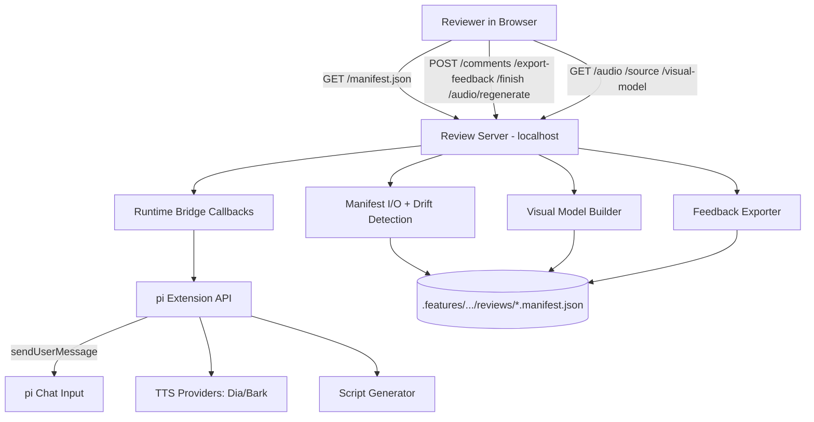
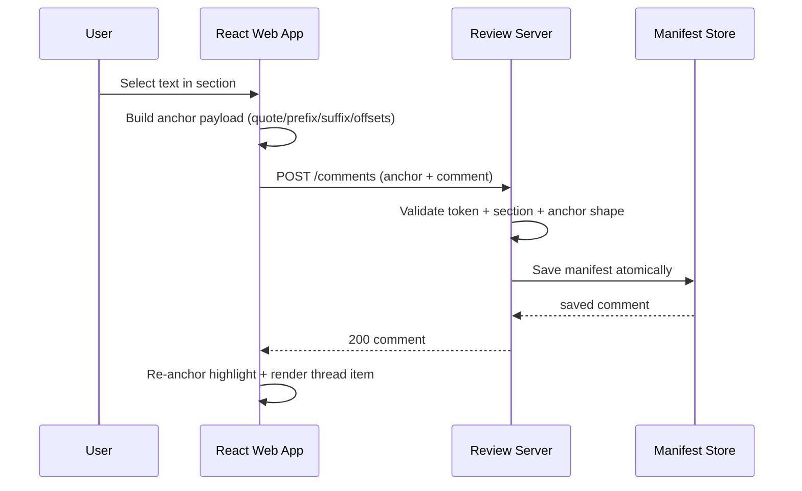
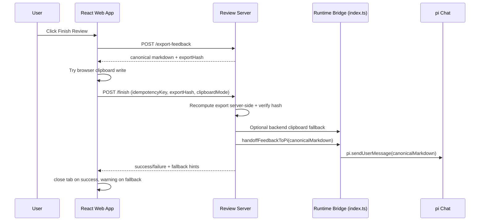
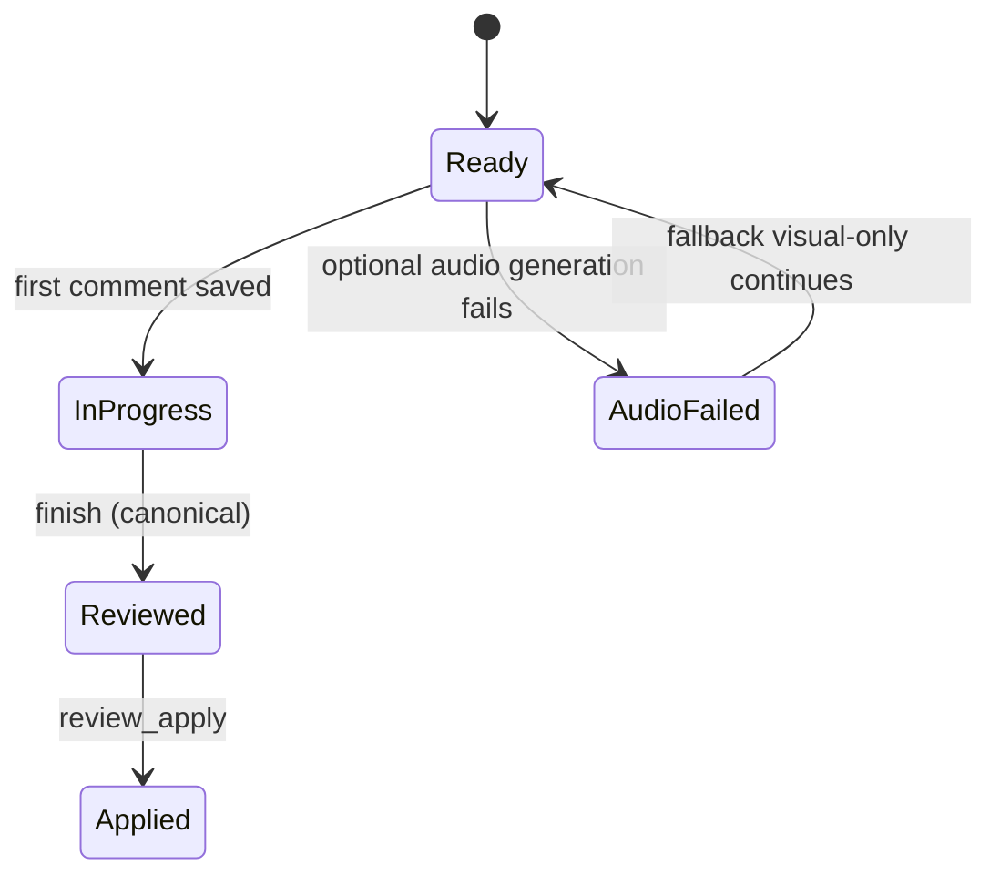
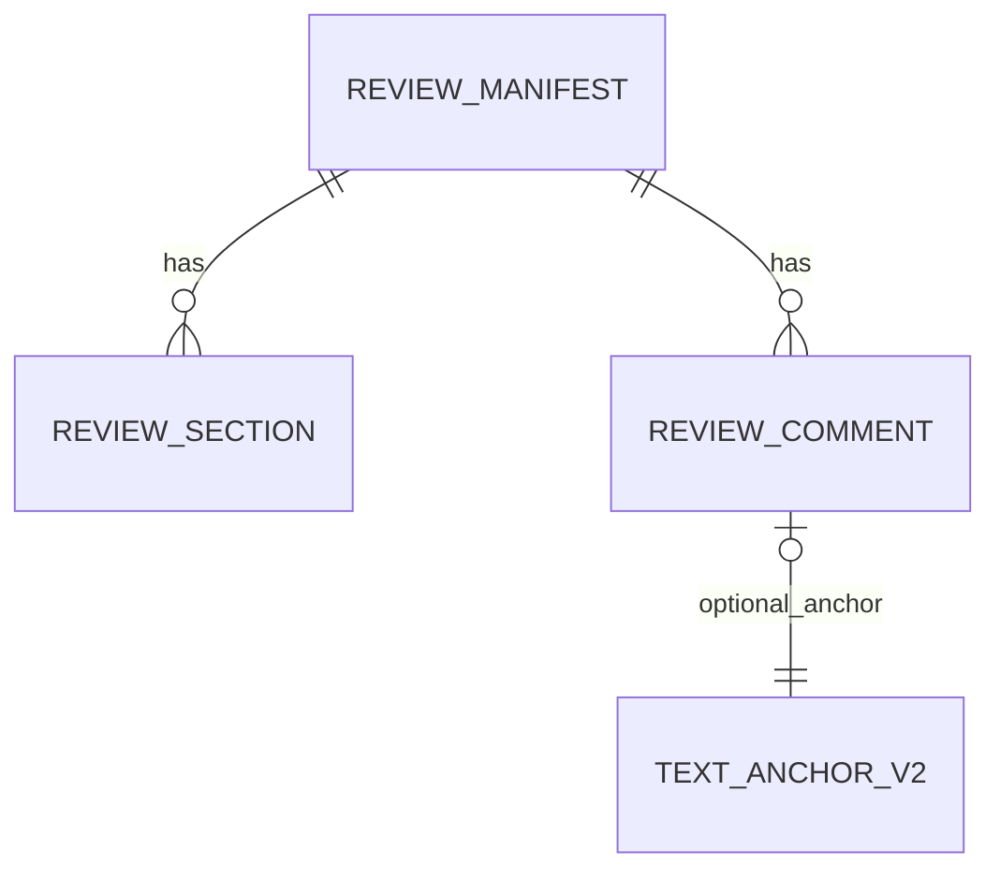

# Technical Design: Review Hub Rebuild (Charm Edition)

## 1. Overview

We will rebuild the Review Hub web app as a new React architecture focused on readability, text-selection comments, and low-friction handoff to pi. The backend keeps the proven manifest parsing/security model, but evolves to a v2 comment anchor schema and new export/finish endpoints. The design intentionally separates browser responsibilities (selection, clipboard) from privileged extension responsibilities (send message to pi, session lifecycle), using an explicit runtime bridge.

---

## 2. High-Level Architecture

### 2.1 System Architecture



### 2.2 Core Data Flow (Selection Comment)



### 2.3 Core Data Flow (Finish Handoff)



### 2.4 Review Session State



---

## 3. Codebase Analysis (What Already Exists)

### Reusable Components / Modules

| Module | Path | Usage in rebuild |
|---|---|---|
| Manifest model + parser + drift hashes | `extensions/review-hub/lib/manifest.ts` | Keep as authoritative section map + hashes; extend with schema version + anchor types |
| HTTP server security baseline | `extensions/review-hub/lib/server.ts` | Keep localhost-only + session token pattern; extend routes |
| Extension orchestration + lifecycle | `extensions/review-hub/index.ts` | Keep command/tool integration; add runtime bridge callbacks for finish/audio actions |
| TTS abstraction + providers | `extensions/review-hub/lib/tts/provider.ts`, `lib/tts/{dia,bark,installer}.ts` | Keep for audio generation and status workflows |
| Script generation | `extensions/review-hub/lib/script-generator.ts` | Keep for narration script generation |
| Apply pipeline | `extensions/review-hub/lib/applicator.ts` | Keep (adjacent flow), no major redesign required |
| React API client pattern | `extensions/review-hub/web-app/src/lib/api/client.ts` | Keep pattern; add new endpoints |
| Review bootstrap hook shape | `extensions/review-hub/web-app/src/hooks/use-review-bootstrap.ts` | Keep concept, rewrite state slices |

### Existing Hooks / Utilities to Reuse or Refactor

| Hook/Utility | Path | Plan |
|---|---|---|
| `use-session-token` | `web-app/src/hooks/use-session-token.ts` | Keep; required for secure mutation routes |
| unresolved navigation logic | `web-app/src/hooks/use-unresolved-navigation.ts` + `src/lib/unresolved-navigation.ts` | Keep algorithm; adapt for anchored comments |
| audio sync utility | `web-app/src/hooks/useAudioSync.ts` + `src/lib/audio-player.ts` | Keep as baseline; improve section/anchor sync |

### Existing Patterns to Follow

- **Atomic manifest writes:** temp + rename in `saveManifest`.
- **Local-only security model:** bind `127.0.0.1`, token-gated mutating routes.
- **Server as source of truth:** frontend fetches manifest and mutates via API only.
- **Progressive fallback:** audio failures do not block visual review.

### Keep / Replace Summary

- **Keep:** backend manifest contract, security posture, TTS pipeline abstractions.
- **Replace:** current frontend UI tree and visual host implementation.
- **Deprecate:** legacy `web/` fallback static app after rebuild stabilization.

---

## 4. Data Model

## 4.1 Manifest Schema Evolution (v2)

Add explicit versioning and anchored comment model.

### New/Modified Types

```ts
interface ReviewManifest {
  schemaVersion: 2;
  // existing fields retained
  finishMeta?: {
    lastFinishIdempotencyKey?: string;
    lastExportHash?: string;
    lastFinishedAt?: string;
  };
}

interface ReviewComment {
  id: string;
  sectionId: string;
  type: "change" | "question" | "approval" | "concern";
  priority: "high" | "medium" | "low";
  text: string;
  status?: "open" | "resolved";
  createdAt: string;
  updatedAt?: string;
  audioTimestamp?: number;

  anchor?: TextAnchorV2;
}

interface TextAnchorV2 {
  version: 2;
  sectionId: string;
  quote: string;         // exact selected text (max 280 chars)
  prefix?: string;       // nearby context before quote (max 80)
  suffix?: string;       // nearby context after quote (max 80)
  startOffset?: number;  // UTF-16 char offsets within normalized section text
  endOffset?: number;
  sectionHashAtCapture?: string;
  anchorAlgoVersion: "v2-section-text";
}

interface RuntimeAnchorResolution {
  commentId: string;
  state: "exact" | "reanchored" | "degraded";
  warning?: string;
}
```

### Migration Strategy

- Legacy manifests with missing `schemaVersion` are interpreted as **v1**.
- v1 comments (no `anchor`) remain valid and are normalized to v2-compatible runtime shape.
- Degraded anchor state is runtime-only (`RuntimeAnchorResolution`), not persisted in `TextAnchorV2`.
- Persist migration only on write (lazy migration).
- Unknown future `schemaVersion` (greater than supported) -> explicit actionable error (no silent parse).
- Corrupt anchor payload on an individual comment is dropped non-fatally for that comment, with a warning.

### Relationship Model



### 4.2 Anchor Normalization Contract

To avoid false drift and offset mismatches, both capture and re-anchor use the same normalization rules:

1. Work within one section root only (selected section).
2. Convert line endings to `\n`.
3. Collapse runs of whitespace to a single space for matching, while preserving original raw quote for display.
4. Compute offsets against normalized section text (UTF-16).
5. Re-anchor strategy order:
   - offset match + quote verification
   - quote + prefix/suffix scoring fallback
   - degrade to section-level with warning

---

## 5. API Design

## 5.1 Existing Endpoints (retained)

| Method | Path | Notes |
|---|---|---|
| GET | `/manifest.json` | Returns normalized v2 manifest |
| GET | `/audio` | Existing behavior |
| GET | `/source` | Existing behavior |
| POST | `/comments` | Extended to accept `anchor` |
| DELETE | `/comments/:id` | Existing behavior |
| POST | `/complete` | Deprecated compatibility alias; internally routes to canonical finish completion semantics |

## 5.2 New Endpoints

| Method | Path | Request | Response | Purpose |
|---|---|---|---|---|
| GET | `/visual-model` | none | `{ sections: RenderSection[] }` | Canonical section render payload from backend parser (prevents parser drift) |
| POST | `/export-feedback` | `{ scope?: "open" }` | `{ markdown: string, exportHash: string, stats: {...} }` | Deterministic compact markdown export |
| POST | `/finish` | `{ idempotencyKey: string, exportHash: string, clipboardMode: "browser" \| "backend-fallback" }` | `{ success: boolean, handedOff: boolean, copiedByBackend?: boolean, warning?: string }` | Canonical completion route: verify export hash, mark reviewed, optional clipboard fallback, handoff to pi |
| POST | `/clipboard/copy` | `{ markdown: string }` | `{ copied: boolean, warning?: string }` | Explicit backend clipboard helper for permission fallback |
| POST | `/audio/regenerate` | `{ fastAudio?: boolean }` | `{ accepted: boolean, status: "generating" }` | Trigger audio regen action from UI |
| GET | `/audio/status` | none | `{ state, reason?, progress? }` | Pollable audio lifecycle status |

## 5.3 Security Requirements for New Routes

- `/export-feedback`, `/finish`, `/clipboard/copy`, `/audio/regenerate` require `X-Session-Token`.
- `/finish` must enforce idempotency key and verify `exportHash` against server-recomputed export payload.
- Persist last successful finish idempotency data in manifest metadata (restart-safe dedupe).
- Sanitization for exported markdown (no HTML/script injection payloads).
- Keep request-size limits and localhost binding.
- After frontend bootstrap, remove `?token=` from URL via `history.replaceState`.
- Serve strict referrer policy headers for review UI responses.

---

## 6. Component Architecture (Frontend)

## 6.1 New Component Map

| Component | Responsibility | Reuses |
|---|---|---|
| `ReviewShell` | Top-level mode switching + layout orchestration | Existing session/bootstrap patterns |
| `DocumentViewport` | Render canonical sections with typography and anchors | `react-markdown`, custom renderers |
| `SelectionCapture` | Detect single-range selection and open composer | DOM selection APIs |
| `HighlightLayer` | Re-anchor and paint quoted ranges | custom anchor engine |
| `CommentRail` | Thread list/filter/status actions | existing unresolved logic pattern |
| `CommentComposer` | Create/edit comments with quote preview | existing form semantics |
| `ExportSheet` | Preview compact markdown before finish | new export API |
| `FinishActionBar` | Copy + finish + fallback handling | new finish API |
| `AudioBar` | player controls + sync + status cards | existing audio hook logic |

## 6.2 State Management

Use local React state + focused hooks (no heavy global store initially):

- `useReviewSession`: manifest, comments, mutation status
- `useSelectionAnchor`: capture selection -> anchor draft
- `useReanchorMap`: compute resolved highlight states
- `useExportFeedback`: fetch/preview deterministic markdown
- `useFinishFlow`: clipboard write + finish call + close behavior
- `useAudioStatus`: audio lifecycle actions + polling

## 6.3 Data Fetching / Sync

- Bootstrap with `GET /manifest.json` + `GET /visual-model`.
- Optimistic updates for comment CRUD.
- Server remains source of truth after each mutation.
- Avoid deriving section IDs client-side from markdown headings.

---

## 7. Backend Architecture

## 7.1 Handler → Service Flow

Introduce service boundaries in `lib/server.ts` (or split files):

- `CommentService` (validate + normalize + persist comments)
- `AnchorService` (anchor validation and migration normalization)
- `ExportService` (compact markdown serializer)
- `FinishService` (idempotency + bridge handoff)
- `AudioActionService` (regeneration/status updates)

## 7.2 Runtime Bridge

Add explicit bridge interface passed from `index.ts` when creating server:

```ts
interface ReviewRuntimeBridge {
  handoffFeedbackToPi(markdown: string): Promise<void>; // wraps pi.sendUserMessage
  copyToClipboard(markdown: string): Promise<{ copied: boolean; warning?: string }>;
  requestAudioRegeneration(reviewId: string, options?: { fastAudio?: boolean }): Promise<void>;
}
```

This keeps privileged operations in extension boundary, not raw HTTP handlers.

## 7.3 Business Logic Rules

- Comment creation with anchor requires valid `sectionId` and non-empty quote.
- Cross-section selections are clamped to origin section and flagged.
- Export order: document order (section index), then creation time.
- Finish flow is server-authoritative: server recomputes canonical export payload before handoff.
- Clipboard-attempt is client-first; backend clipboard helper is used only on explicit fallback mode.
- `/finish` marks `status=reviewed` and `completedAt` atomically on success.
- Double finish attempts return idempotent success for same key (including restart-safe cases via manifest finish metadata).

---

## 8. Integration Points

- **Manifest parser & drift detection:** `lib/manifest.ts` remains canonical source.
- **Generation pipeline:** `index.ts generateReview()` continues to produce manifest/audio.
- **Review apply flow:** unchanged entry points (`/review-apply`, `review_apply` tool).
- **TTS providers:** reused for regenerate action.
- **Pi chat handoff:** `pi.sendUserMessage` via runtime bridge on `/finish`.

Cross-cutting concerns:

- Auth: session token for mutations
- Validation: strict schema validation for v2 payloads
- Logging: per-review log file remains the diagnostic anchor
- Error UX: recoverable warnings + manual fallback paths

---

## 9. Implementation Plan per User Story

### US-001: Clean reader shell with Read/Review modes

**What changes:**
- `web-app/src/App.tsx` (replaced)
- `web-app/src/components/shell/*` (new)
- `web-app/src/styles/*` (new custom styling)

**How it works:**
- Build new shell primitives with explicit mode toggles.
- Desktop: 3-column; mobile: drawers.
- Read mode simplifies UI and widens text viewport.

---

### US-002: Deterministic markdown rendering with section map

**What changes:**
- `lib/server.ts` -> add `GET /visual-model`
- `lib/visual-model.ts` (new)
- `web-app/src/components/document/document-viewport.tsx` (new)

**How it works:**
- Server emits canonical section chunks using manifest line ranges.
- Frontend renders section markdown with `react-markdown` + plugins.
- No client-side section ID derivation.

---

### US-003: Add comment from selected text

**What changes:**
- `web-app/src/lib/anchor/capture.ts` (new)
- `web-app/src/hooks/use-selection-anchor.ts` (new)
- `lib/manifest.ts` comment types extended with `anchor`
- `lib/server.ts` `/comments` validator update

**How it works:**
- On selection end, capture quote/prefix/suffix/offsets within section text.
- Auto-open composer with anchor draft.
- Save comment + anchor in manifest.

---

### US-004: Comment thread management

**What changes:**
- `web-app/src/components/comments/*` (rewritten)
- `web-app/src/hooks/use-review-session.ts` (new)
- `web-app/src/lib/unresolved-navigation.ts` (adapt)

**How it works:**
- Preserve open/resolved workflow, filtering, unresolved navigation.
- Comment item links to section + anchor highlight resolution.

---

### US-005: Audio playback and section sync

**What changes:**
- `web-app/src/components/audio/audio-bar.tsx` (new)
- `web-app/src/hooks/use-audio-player.ts` (new/rework)
- `web-app/src/lib/audio-sync.ts` (new)

**How it works:**
- HTMLAudioElement-based player with seek/speed/sync.
- Section sync toggles active section updates.

---

### US-006: Audio generation status/actions

**What changes:**
- `lib/server.ts` add `/audio/status`, `/audio/regenerate`
- `index.ts` runtime bridge implementation for regeneration
- `web-app/src/hooks/use-audio-status.ts` (new)

**How it works:**
- Status endpoint reflects generation lifecycle.
- Regenerate action triggers bridge callback and updates status.

---

### US-007: Compact markdown feedback export

**What changes:**
- `lib/export-feedback.ts` (new)
- `lib/server.ts` add `/export-feedback`
- `web-app/src/components/export/export-sheet.tsx` (new)

**How it works:**
- Serialize open comments only.
- Include quote snippets + concise action bullets.
- Deterministic sorting by section order.
- Return `exportHash` for stale/tamper protection in finish flow.

---

### US-008: Finish flow (copy/close/auto-paste)

**What changes:**
- `lib/server.ts` add `/finish`, `/clipboard/copy`, and durable idempotency metadata handling
- `index.ts` runtime bridge `handoffFeedbackToPi` + `copyToClipboard`
- `web-app/src/hooks/use-finish-flow.ts` (new)

**How it works:**
1. Client requests canonical export payload (`markdown + exportHash`).
2. Client attempts Clipboard API write.
3. If browser copy fails, client calls `/clipboard/copy` fallback.
4. Client calls `/finish` with idempotency key + exportHash + clipboard mode used.
5. Server recomputes export, verifies hash, marks review complete, and invokes `pi.sendUserMessage`.
6. Client closes tab on success, otherwise warns and keeps manual fallback.

---

### US-009: Data model/API v2 + migration

**What changes:**
- `lib/manifest.ts` versioned schema + normalization
- `lib/server.ts` manifest normalization at load/start
- `test/*` add migration and versioning coverage

**How it works:**
- Missing `schemaVersion` is treated as v1 and normalized.
- v1 comments tolerated and normalized with runtime degraded anchor state if no anchor exists.
- unknown future schema versions fail fast with actionable error.
- persistence writes v2 shape.

---

## 10. Suggested Improvements

| Area | Current State | Suggested Improvement | Impact | Priority |
|---|---|---|---|---|
| Section identity parity | Backend parser + frontend rendering can drift | Introduce `/visual-model` canonical section payload | Prevents anchor/nav drift bugs | High |
| Finish reliability | No handoff endpoint | Two-phase finish + idempotency + runtime bridge | Reliable pi handoff, safer retries | High |
| Schema robustness | Minimal manifest validation | Add `schemaVersion` + strict normalization | Safer migrations, fewer silent failures | High |
| Legacy frontend | `web/` fallback still shipped | Deprecate after rebuild stabilization | Simpler maintenance | Medium |
| Server structure | Monolithic handler file | Split into services (comment/export/finish/audio) | Easier testing and extension | Medium |

---

## 11. Trade-offs & Alternatives

### Decision: Canonical render model from backend
- **Chosen:** backend provides section-scoped render model (`/visual-model`).
- **Alternative:** frontend parses source markdown independently for section IDs.
- **Why:** avoids parser mismatch and anchor drift.

### Decision: Custom lightweight section-scoped anchor engine
- **Chosen:** quote+context+offsets scoped per section.
- **Alternative:** full DOM XPath anchoring framework.
- **Why:** simpler and sufficient for single-section selection requirement; lower complexity.

### Decision: Client-first clipboard + server-authoritative finish
- **Chosen:** client attempts clipboard first, then server verifies export hash, finalizes review, and performs pi handoff.
- **Alternative:** trust client payload directly or backend-only atomic finish.
- **Why:** browser clipboard requires user gesture, and trusting client payload weakens determinism/security.

### Decision: Keep existing TTS backend, rebuild UI only
- **Chosen:** reuse Dia/Bark/script pipeline.
- **Alternative:** redesign entire audio backend.
- **Why:** reduces scope/risk, aligns with pragmatic rebuild goal.

---

## 12. Open Questions

- [ ] Do we keep `/visual` and `/visual-styles` during transition, or fully switch to `/visual-model` in one release?
- [ ] For degraded anchors, should UI require reviewer confirmation before export, or only show warnings?
- [ ] Should backend clipboard fallback be macOS-only initially or pluggable by OS from day one?

---

## Appendix: Feedback Export Format (Compact Markdown)

```md
# Review Feedback (open items)
Source: <relative path>
Review: <review-id>

- [change][high] section: s-user-stories
  quote: "As a user, I can ..."
  action: Clarify acceptance criteria and measurable success condition.

- [question][medium] section: s-technical-considerations
  quote: "We may use Redis"
  action: Specify why Redis is needed and fallback if unavailable.

- [change][low] section: s-goals
  quote: [degraded-anchor]
  action: Re-verify wording manually (source changed since capture).
```

Token-efficiency rules:
- no narrative filler
- no repeated section metadata
- one action line per comment
- quote clipped to max length with ellipsis when needed
