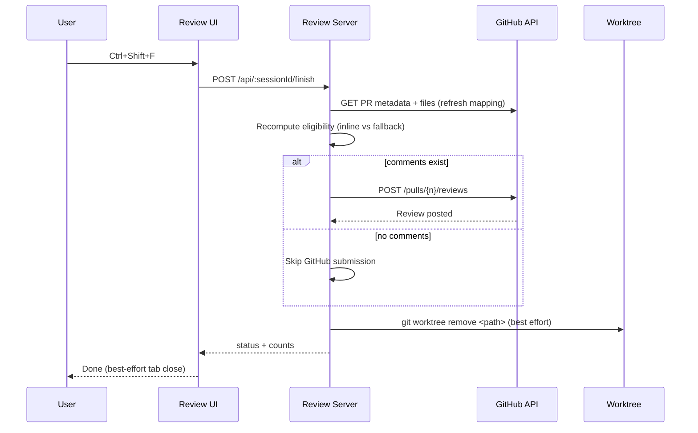

# Technical Design: PR-Native Document Review Comments

## 1) Executive Summary

We will extend the existing `document-reviewer` extension so users can review markdown files from a GitHub PR and publish comments directly into that PR review.

**Approach:** add a new `/review-pr` command and `review_pr` tool that resolve PR metadata via `gh api`, create a PR-scoped worktree, open a browser review session for a selected changed markdown file, then submit one GitHub review on finish. Inline comments are posted when reliably mappable to changed RIGHT-side lines; all other comments are aggregated into a single fallback section in the review body.

**Reusing:** existing review command/tool patterns in `extensions/document-reviewer.ts`, local review server/session lifecycle in `extensions/document-reviewer/server.ts`, browser launcher in `extensions/lib/open-external.ts`, and git worktree helpers in `extensions/lib/worktree.ts`.

**New:** PR URL parsing + GitHub API adapter, PR worktree lifecycle helper (create/read/cleanup), PR-diff mapping utility, PR session mode in review server, and PR submission pipeline.

**Scope:** medium feature. ~3 new helper modules, significant updates to `document-reviewer.ts` and `document-reviewer/server.ts`, and small reviewer UI additions for PR metadata display and mode-specific behavior.

**Key decisions:**
1. v1 supports **GitHub base-repo PRs only** (no fork PRs).
2. PR comments are submitted as **one review** (`event: COMMENT`) for coherent output.
3. Fallback comments are aggregated in a **single “Fallback comments”** review-body section.
4. PR review worktree is **deleted after review submission** (with best-effort recovery cleanup).

---

## 2) How It Works

### Flow A — Start a PR review

1. User runs `/review-pr https://github.com/org/repo/pull/123 [docs/file.md]`.
2. Extension validates URL format and checks `gh auth status`.
3. Extension calls `gh api /repos/{owner}/{repo}/pulls/{number}` and verifies:
   - PR exists and is open.
   - `head.repo.full_name === base.repo.full_name` (non-fork v1 constraint).
4. Extension validates local repository identity against PR base repo (`origin` remote owner/repo must match).
5. Extension calls `gh api /repos/{owner}/{repo}/pulls/{number}/files` and filters markdown files.
6. If file path is not provided and more than one markdown file exists, extension returns candidate list.
7. Extension creates PR-scoped worktree at deterministic path (detached at PR `head.sha`).
8. Extension reads selected markdown file from the worktree and creates a **PR review session** in the local review server.
9. Browser opens the session URL using existing launcher behavior.

### Flow B — Review in browser

1. Reviewer navigates markdown content (existing keyboard model).
2. Reviewer selects text and presses `c` to draft a comment.
3. UI sends comment draft to session API including selected text + line metadata.
4. Server stores draft comment and precomputes whether it can be inline-mapped (or fallback).

### Flow C — Finish and publish

1. Reviewer presses `Ctrl+Shift+F` and confirms finish.
2. Browser calls `POST /api/:sessionId/finish`.
3. Server refreshes PR metadata **and** files (`/pulls/{n}` + `/pulls/{n}/files`) and recomputes mapping.
4. If `head.sha` changed since session start, server degrades all drafts to fallback (safe mode; no inline placement on moved diff).
5. Server partitions comments:
   - **Inline**: single-line comments whose `lineEnd` maps to changed RIGHT-side lines in refreshed patch.
   - **Fallback**: unmappable comments and all multi-line selections.
6. If there is at least one comment (inline or fallback), server submits one review via `gh api POST /repos/{owner}/{repo}/pulls/{number}/reviews`:
   - `event: COMMENT`
   - `comments[]` with inline comments
   - `body` containing summary + single aggregated fallback section.
7. If there are zero comments, server skips GitHub submit and returns `no comments` completion.
8. Server returns summary (inline/fallback/error counts).
9. Session is closed and PR worktree is removed (best-effort, including no-comment flow).
10. Pi displays completion message and apply-next-step hints.

---

## 3) High-Level Architecture

### System Architecture

```mermaid
graph TD
  U[User in Pi] --> C[/review-pr command or review_pr tool/]
  C --> G[GitHub Adapter\n(gh api)]
  C --> W[PR Worktree Helper\n(git worktree add/remove)]
  C --> S[DocumentReviewService\nPR session mode]
  S --> B[Browser Review UI]
  B --> S
  S --> G
  S --> W
  G --> GH[(GitHub PR API)]
```

### Core Data Flow (submit)



---

## 4) Codebase Analysis (What Already Exists)

### Reusable extension components

| Component | Path | How we reuse it |
|---|---|---|
| Review command/tool skeleton | `extensions/document-reviewer.ts` | Mirror pattern for `/review-pr` + `review_pr` with shared validation and background session tracking |
| Review session HTTP service | `extensions/document-reviewer/server.ts` | Extend with PR session mode + finish handler variant for GitHub submission |
| Review browser UI | `extensions/document-reviewer/review-page.ts` | Reuse keyboard/comment UX; add PR mode metadata and line-aware draft payload |
| External browser launcher | `extensions/lib/open-external.ts` | Reuse unchanged for opening PR review page URL |
| Git worktree lifecycle utilities | `extensions/lib/worktree.ts` | Reuse repo detection/git wrappers/list/remove patterns; add PR-scoped helper |
| Command/tool API style reference | `extensions/worktree-manager.ts` | Follow command + tool parity and parameter structure |

### Existing patterns to follow

- **Validation-first command handlers** with actionable UI errors (`document-reviewer.ts`, `worktree-manager.ts`).
- **Background completion tracking** via status indicator (`activeReviewSessionCount` pattern).
- **Single extension as command+tool** for both interactive and LLM-driven workflows.

---

## 5) Data Model

### New/extended in-memory entities

```ts
type ReviewSessionMode = "document" | "pull_request";

interface PullRequestContext {
  owner: string;
  repo: string;
  number: number;
  url: string;
  title: string;
  headSha: string;
  baseSha: string;
  selectedFilePath: string; // repo-relative
  worktreePath: string;
  changedRightLines: number[]; // derived from patch
}

interface ReviewCommentDraft {
  id: string;
  selectedText: string;
  comment: string;
  offsetStart: number;
  offsetEnd: number;
  lineStart?: number;
  lineEnd?: number;
  inlineEligible?: boolean;
  fallbackReason?: string;
}
```

### Session changes

- `ActiveSession` will become mode-aware:
  - `document` mode: existing local annotation writeback.
  - `pull_request` mode: publish to GitHub review + cleanup worktree.

### No persistent DB/schema migration

All state remains process-memory for v1, matching current extension architecture.

---

## 6) API Design

### Internal local review service endpoints

| Method | Path | Change |
|---|---|---|
| `GET` | `/api/:sessionId/document` | Add mode + PR metadata payload for PR session rendering |
| `POST` | `/api/:sessionId/comments` | Accept optional line metadata fields (`lineStart`, `lineEnd`, `inlineEligible`) |
| `POST` | `/api/:sessionId/finish` | Branch by session mode: local annotation OR GitHub review submission |

### GitHub endpoints (via `gh api`)

| Method | Endpoint | Purpose |
|---|---|---|
| `GET` | `/repos/{owner}/{repo}/pulls/{number}` | PR metadata, head/base SHA, fork check |
| `GET` | `/repos/{owner}/{repo}/pulls/{number}/files` | Changed files + patch for markdown filter and mapping |
| `POST` | `/repos/{owner}/{repo}/pulls/{number}/reviews` | Publish single review with inline comments + fallback section |

### Review publish payload (target)

```json
{
  "commit_id": "<head_sha>",
  "event": "COMMENT",
  "body": "Review summary\n\n### Fallback comments\n- ...",
  "comments": [
    {
      "path": "docs/file.md",
      "body": "inline comment text",
      "line": 42,
      "side": "RIGHT"
    }
  ]
}
```

---

## 7) Component Architecture (Frontend)

### Reviewer UI changes (`extensions/document-reviewer/review-page.ts`)

| Area | Change |
|---|---|
| Header metadata | Show PR label (`owner/repo#number`) and target file path in PR mode |
| Comment payload | Include line metadata in draft comment requests |
| Finish UX | Preserve existing modal + best-effort auto-close; show publish summary text |
| Validation UX | If comment is unmappable, keep comment creation allowed and label as fallback in sidebar |

### Line metadata strategy

- Keep current selection UX.
- Add deterministic line derivation from source markdown offsets in PR mode.
- Inline eligibility is **single-line only** in v1 (`lineEnd`, `side: RIGHT`).
- Multi-line selections are always routed to fallback section in v1.
- Eligibility is recomputed on finish from refreshed PR patch data.

---

## 8) Backend Architecture

### Proposed modules

| Module | Responsibility |
|---|---|
| `extensions/document-reviewer/github-pr.ts` | Parse PR URLs, run `gh api` calls, normalize PR/file payloads, submit reviews |
| `extensions/document-reviewer/pr-diff-map.ts` | Parse unified patch and compute changed RIGHT-side line set per file |
| `extensions/document-reviewer/pr-worktree.ts` | Create/read/delete PR-scoped worktree (detached at head SHA) |

### Server mode split

- `DocumentReviewService.createSession(filePath)` remains for local mode.
- Add `createPullRequestSession(context)` for PR mode.
- `finish` handler dispatch:
  - `document`: existing `insertCommentsIntoMarkdown`.
  - `pull_request`: `publishPullRequestReview` then cleanup.

### Core business logic rules

1. Inline comment only if confidently mappable to a refreshed RIGHT-side changed line.
2. Multi-line selections are fallback-only in v1.
3. Unmappable comments are preserved in one aggregated fallback section.
4. Fork PRs are rejected early (v1 boundary).
5. Local repo must match PR base repo before checkout.
6. Worktree cleanup is attempted after every finish path (posted review, no-comment finish, or recoverable submit error).
7. If grouped submit fails due inline validation (e.g., 422), retry once with fallback-only body so feedback is not lost.

---

## 9) Integration Points

- **Git repo context:** use existing `getRepoContext` + git helper style from `extensions/lib/worktree.ts`, plus mandatory `origin` remote match against PR base repo.
- **UI status updates:** reuse `ctx.ui.setStatus("review", ...)` and completion message style from `document-reviewer.ts`.
- **Tool parity:** add `review_pr` tool with same behavior as `/review-pr`, following `review` and `worktree_manage` patterns.
- **Cross-platform browser:** unchanged via `openExternal`.

---

## 10) Implementation Plan per User Story

### US-001: Start review from PR URL

**What changes:**
- `extensions/document-reviewer.ts` — add `/review-pr` command parsing and validation.
- `extensions/document-reviewer/github-pr.ts` (new) — URL parsing + gh auth + PR metadata retrieval.

**How it works:**
- Validate URL and auth.
- Resolve owner/repo/number + head/base details.
- Enforce base-repo-only policy.
- Validate local repo identity (`origin`) matches PR base repo before continuing.

---

### US-002: Create PR worktree, review markdown changes, clean up worktree

**What changes:**
- `extensions/document-reviewer/pr-worktree.ts` (new) — deterministic worktree path creation/removal.
- `extensions/document-reviewer.ts` — select markdown file from changed files and create PR session.

**How it works:**
- Filter changed files to markdown.
- Create detached worktree at head SHA.
- Read target file content and start PR review session.
- Remove worktree after finish pipeline.

---

### US-003: Post inline PR review comments on finish

**What changes:**
- `extensions/document-reviewer/server.ts` — add PR-mode finish path.
- `extensions/document-reviewer/github-pr.ts` — `submitReview(...)` API wrapper.
- `extensions/document-reviewer/pr-diff-map.ts` (new) — inline eligibility mapping.

**How it works:**
- Refresh head SHA and changed files; recompute diff eligibility.
- If head SHA changed, downgrade all drafts to fallback to avoid stale inline placement.
- Convert eligible single-line drafts into GitHub inline comments.
- Submit one grouped review.

---

### US-004: Fallback non-inline comments

**What changes:**
- `extensions/document-reviewer/server.ts` — fallback aggregation builder.

**How it works:**
- Build a single markdown section:
  - `### Fallback comments`
  - one bullet block per unmappable comment (file + snippet + note)
- Truncate snippets to a safe max length and escape markdown/control sequences.
- Include section in review body when fallback exists.

---

### US-005: Tool support for agent-driven flow

**What changes:**
- `extensions/document-reviewer.ts` — register `review_pr` tool with parameters:
  - `url: string` (required)
  - `path?: string` (optional markdown file path)

**How it works:**
- Same service path as command.
- Structured tool output includes session metadata + submission summary.

---

## 11) Suggested Improvements

| Area | Current State | Suggested Improvement | Impact | Priority |
|---|---|---|---|---|
| Session security | CORS currently broad for local service | Enforce stricter session token checks and origin constraints for write-capable PR mode | Reduces local abuse risk | High |
| Reviewer dependencies | UI loads CDN libraries | Bundle/vendor JS assets for privileged review pages | Supply-chain hardening | Medium |
| Session reliability | In-memory only lifecycle | Persist minimal crash-recovery metadata for PR worktree ownership | Safer cleanup after crash | Medium |

---

## 12) Trade-offs & Alternatives

### Decision: use PR-scoped worktree instead of in-memory blob-only mode
- **Chosen:** create detached PR worktree and read actual file from filesystem.
- **Alternative:** render directly from `gh api`/`git show` in-memory blobs.
- **Why:** user explicitly requested PR checkout behavior; worktree aligns with requested workflow and existing repo tooling.
- **Trade-off:** cleanup complexity and crash-recovery concerns.

### Decision: inline only RIGHT-side changed-line mapping in v1
- **Chosen:** inline for confidently mappable RIGHT-side lines; fallback otherwise.
- **Alternative:** support LEFT-side deletions and multi-line hunk-aware comments in v1.
- **Why:** keeps mapping correctness high and avoids fragile diff-position logic.
- **Trade-off:** fewer inline comments in edge cases.

### Decision: single review submit call
- **Chosen:** one `POST /reviews` with all inline + fallback body.
- **Alternative:** individual comment posts.
- **Why:** coherent UX, lower notification noise, easier summarization.
- **Trade-off:** one invalid inline comment can fail full submission; mitigation is pre-validation plus one fallback-only retry.

---

## 13) Open Questions

- If GitHub submission times out with unknown final state, should we show explicit "submission may have succeeded" guidance before cleanup?
- Should v1 cap maximum markdown file size for review session to avoid performance degradation in browser UI?
